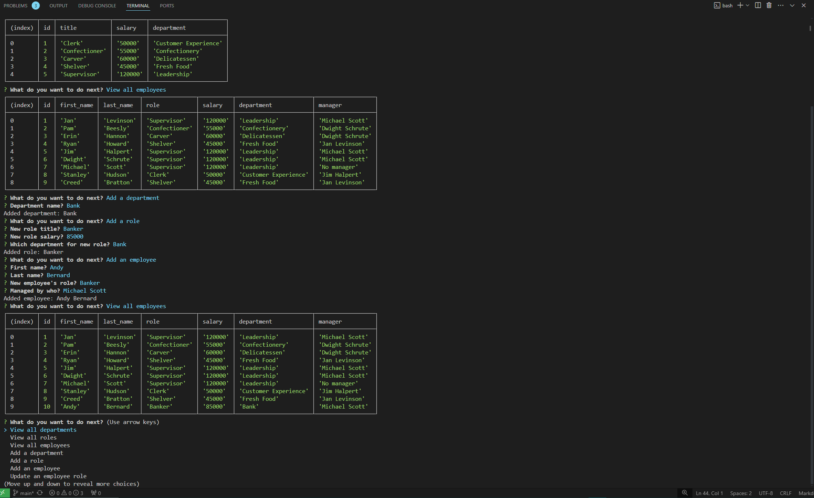

# HRTracker

HRTracker is a command-line application designed to manage a company's employee database. Built with Node.js, Inquirer, and PostgreSQL. HRTracker enables users to view and organize departments, roles, and employees. The application provides an intuitive interface for handling essential employee management tasks efficiently.

- View all departments: Users can see a neatly formatted table displaying all department names along with their IDs.

- View all roles: Users can browse a table showing job titles, role IDs, associated departments, and corresponding salaries for each role.

- View all employees: Users can examine a detailed table with employee information, including IDs, names, job titles, and salaries.

- Add a department: Users can input a new department name to add it to the database.

- Add a role: Users can input an employee's name, salary, and department to include them in the employee database.

- Add an employee: Users can input a new employee's first name, last name, role, and manager, then add them to the database.

- Update an employee's role: Users can select an employee and modify their role within the company's database.

## Installation

To install HRTracker:

- Clone the repository: https://github.com/AcoderRose/HRTracker

- Go to the project directory

- Launch the terminal and execute the following command: `npm install`

- Set up the PostgreSQL database with the following commands:

  - Input `psql -U postgres` to open PostgreSQL command line interface, input password if needed.
  - Set up database by inserting schema.sql and seeds.sql files using `\i schema.sql` press enter.
  - Then input `\i seeds.sql` command hit enter again and your database is set up correctly.

- Once the database is established. The user will need to Remove '.EXAMPLE' from the '.env.EXAMPLE' file renaming it to just '.env' to ensure it is hidden.

- User will then fill out that '.env' file with their database credentials.

## Usage

- Run the following command in your terminal to start the application: `node index.js`

- Adhere to the application's guided prompts to navigate through the menu choices.

[Link to Walk Through Video](https://drive.google.com/file/d/1vBZDhbVeEK3Xo1D6skpk8eZPW_-hZtgs/view?usp=sharing)

## Credits

[Kaila Ronquillo](https://github.com/girlnotfound)

[Ryan Petersen](https://github.com/RyanPetersen-89)
